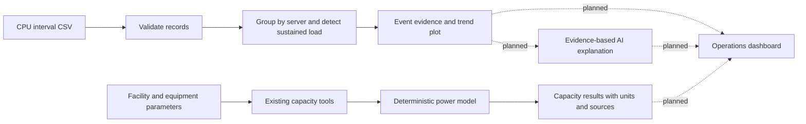

# OpsAI architecture

```mermaid
flowchart LR
  CSV[CPU interval CSV] --> V[Validate records]
  V --> R[Group by server and detect sustained load]
  R --> E[Event evidence and trend plot]
  E -. planned .-> UI[Operations dashboard]
  E -. planned .-> AI[Evidence-based AI explanation]
  AI -. planned .-> UI
  P[Facility and equipment parameters] --> T[Existing capacity tools]
  T --> M[Deterministic power model]
  M --> C[Capacity results with units and sources]
  C -. planned .-> UI
```

实线为可本地运行的流程；虚线为计划功能。CPU 读数与设施功率参数来源不同，两条路径独立。运营页面尚未部署。现有容量 CLI 可选用 LLM，本地 CPU 示例无需密钥。
